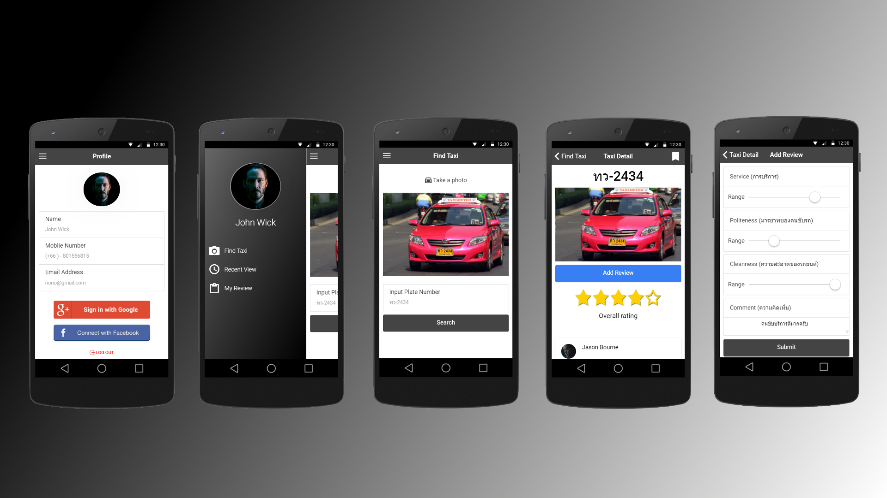

# Taxi Review

This hybrid mobile application is a part of the Hybrid Mobile Development (CS 4404) project that created by Assumption University student.

# How to run this project

### How to run with the Ionic CLI:

```bash
$ git clone https://github.com/Cwanyo/TaxiReview
$ cd TaxiReview
$ npm install
$ ionic serve
```

Then, to run it on ios:

```bash
$ ionic cordova platform add ios
$ ionic cordova run ios
```

or on android:
```bash
$ ionic cordova platform add android
$ ionic cordova run android
```

# Description
The application that allows users to search and check taxi reviews from other users by entering the licence number. Also, users can comment or give rating on that particular taxi.

# Features

### Account Registration 
- Login with Google or Facebook
- Verify account via SMS 

### Find that Taxi
- Find taxi by typing in the licence plate number
- Take a photo of taxi and licence plate (will be collected for research purpose)

### Create a taxi review
- Rating according to categories (e.g. service,politeness or cleanness)
- Comment in text

### View the reviews from other users
- Show taxi details
- Overall rating and comment

# Prototype

Link to our [prototype](https://creator.ionic.io/share/dd7f0f339376)

# Known issues and bugs

# Contributors
- Chatchawan yoojuie
